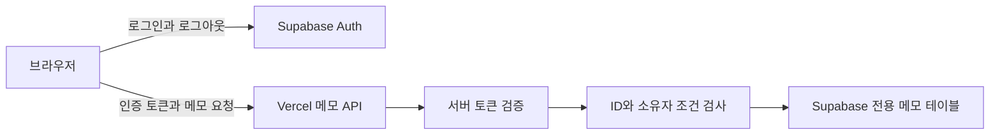

# ALEPH 방어전 기록과 포트폴리오 준비

2026년 10월 6일까지 완료한 1~5단계의 구현, 검증, 실제 심판 결과를 모았습니다. 현재 결과는 **500/500점, 자료함4/4 회복, 괴물16/41 격파**입니다. 6~12단계, 총공세, XDR와 최종 패키지는 아직 완료하지 않았습니다. 이 기록은 최종 패키지 작성에 가져다 쓸 중간 자료입니다.

- 저장소: https://github.com/suminkim8203/choi-bujang-secret-vault
- 시연: https://choi-bujang-secret-vault.vercel.app
- 현재 기능과 실행 방법: [README](../README.md)
- 공식 패키지 안내: https://aleph-omega.vercel.app/package-portfolio.html
- 예약 확인: 사용자 요청으로 2026년 10월 6일 삭제. 다음 단계는 사용자 진행 지시 후 작업합니다.

## 단계별 문제와 해결

| 단계 | 당시 문제와 구현 | 검증과 실제 결과 |
|---|---|---|
| 1 | 공식 시작 틀을 연결해 공개 가상 자료실의 초기 배포와 노출 상태를 확인 | 실제 심판100/100. 원본 가상자료4건의 초기 상태이며 이후 정적 자료를 비웠음 |
| 2 | 정적 파일·최신 저장소에서 가상 메모 제거. Supabase 전용 테이블과 Vercel 서버 API 연결. owner_id UUID, RLS 활성화, auth.users 외래키 없이 준비 | 정적 notes0·당시 API4건, 공개 키 DB 직접 읽기 거부. 최종 재판정100/100, 필수4개·가점3개 |
| 3 | 공식 Supabase Auth 로그인·로그아웃과 서버 토큰 검증, 본인 목록과 메모 CRUD 구현. 원본 인증 도우미 유지 | 익명 CRUD 및 잘못된 토큰401 JSON. 실제 로그인 정상 작성·조회·수정·삭제·삭제후404. 최종 재판정100/100, 필수7개·가점3개 |
| 4 | 개별 ID와 검증된 owner_id를 함께 필터링. 소유자 주입 거부, DB 반환 소유자 재검사. 전용 테이블 RLS 정책 준비 | A→B/B→A 상대 조회·수정·삭제404, 목록 제외, 본인 CRUD 정상, 원본4건 보존. 최종 재판정100/100, 필수7개·가점3개 |
| 5 | 브라우저 메모 요청을 서버 API로 통합. Auth 유지. 전용 테이블 PUBLIC·anon·authenticated 직접 권한 회수 | 공개 키 원본 읽기·수정401/PostgreSQL42501, 익명401. A/B 정상 작업·교차 거부·임시행 정리. 최종 재판정100/100, 필수7개·가점3개 |

현재 운영은5단계입니다. 2단계의 당시 공개 API 상태와4단계의 당시 authenticated 직접 DB 권한을 현재 상태로 설명하지 않습니다. 현재 모든 메모 API는 인증을 요구하며, 본인 자료만 접근할 수 있고 브라우저의 직접 자료 DB 권한은 차단됐습니다.

## 90점에서 100점으로 바뀐 원인

2~5단계는 필수 조건을 모두 통과했지만90점과 가점2개가 반복됐습니다. DB 검증 메타데이터, SQL 증빙, 검색 재현 절차, API 구성과 공개 주소 보완 등은 점수를 올리지 못했습니다.

이후 최신 공식 화면에 기본70점과 가점3개 각10점 기준이 공개됐고, 네 단계 모두 첫 화면의 HTTP 보안 헤더를 요구했습니다. 기존 첫 화면에는 해당 헤더가 없었습니다. `vercel.json.headers`에 `X-Content-Type-Options: nosniff`를 추가하고 실제 응답을 확인한 뒤2→3→4→5를 재제출하자 모두100점·가점3개로 바뀌었습니다. 앱 동작의 변경은 공통 헤더 추가뿐이었습니다. 개별 심판 내부 플래그는 제공되지 않았지만, 공개 기준·헤더 실측·점수 변화가 일치합니다.

## 현재 구성

로그인은 신원 확인이며 소유자 조건은 별도의 권한 검사입니다. 브라우저가 보낸 사용자 번호·역할을 인증 근거로 사용하지 않습니다. 서버 전용 키는 서버 환경변수로만 읽습니다. 브라우저에는 Auth에 필요한 공개 설정이 있으므로, 이를 “어떤 공개 키도 브라우저에 없다”라고 확대해서 설명하지 않습니다. 현재 이 그림은1~5단계 설명용이며 최종 패키지의 전체 구성도를 대신하지 않습니다.

## 검증 증거와 저장 위치

| 자료 | 보관 위치와 사용 방법 |
|---|---|
| 최종 점수판 | [500점 화면](evidence/scoreboard-500.jpg) |
| 단계별 최종 판정 | [2단계](evidence/stage2-100.jpg), [3단계](evidence/stage3-100.jpg), [4단계](evidence/stage4-100.jpg), [5단계](evidence/stage5-100.jpg) |
| 주요 검증 수치 | [검증 요약 JSON](evidence/verification-summary.json). 비밀값과 실제 계정 식별자 제외 |
| 3단계 상세 대조 | [요구사항별 검증 기록](STEP3_VERIFICATION.md). 당시 범위와 결과 기록이며 최신 점수는 이 문서 참조 |
| 현재 자기 점검 | src/attack-check.mjs와 scripts/check-public-notes.mjs. 실제 요청 결과와 로컬 파일 검색을 구분 |
| 코드와 SQL | api/, src/, public/, db/. SQL의 권한 상태는 단계별로 다름 |
| 로컬 상세 증빙 | artifacts/step4-AB-verification.json, step5-AB-verification.json, step5-anonymous-checks.json, bonus-header-retry-state.json 등. Git 제외이며 새 clone에는 없음 |
| 제출 묶음 | artifacts/bonus-header-submission-062b39c.json. 공식 schema v2, 실제 요청9개, step5. 이 파일은 단계2용 묶음이라고 하지 않음. 단계2~5 포털은 배포 URL로 각각 접수했음 |

헤더 보완 후 로컬25개 검사와 빌드가 성공했습니다. 최신 Git42파일·로컬 공개7파일·운영 정적8응답에서 원본 메모 본문과 비밀 패턴을 찾지 못했습니다. 운영 자기 점검9개도 통과했습니다. 로그인 계정의 추가201·조회/수정/삭제200·소유자 주입400·삭제후404·목록3건 복귀를 다시 확인했습니다. 헤더 보완 후 B 계정 시험은 반복하지 않았고, 이전5단계의 실제 A 검증과 사용자 B 사진·정리 보고를 보존했습니다.

SQL 실행과 권한 표의 정상 결과는 사용자 확인 보고입니다. 서버·브라우저 동작과 HTTP 응답은 실제 검증으로 기록했습니다. 로컬 검사, 사용자 보고, 운영 요청, 심판 판정을 서로 대신하는 증거로 쓰지 않습니다. 최종 재판정 접수ID는 읽지 않았습니다.

## 주요 코드 저장점

| 구분 | 커밋 |
|---|---|
| 공식 원본 시작 틀 | 0f9a3c9d23b9eead50b8c03ac78c8a61a7efb7fd |
| 2단계 최초 구현 | 520ff5e349e0614fceb744e5c574d33cb0adb6b0 |
| 3단계 최초 구현 | 8882724 |
| 4단계 소유자 구현 | 1daffe8 |
| 5단계 서버 통합 | 11176723b0e658f97929a78617646ee3c1cb978e |
| 2~5단계100점 재판정 대상 | 062b39c47c37e9e793db329321789532f7d139ea |
| 최종 결과 기록 | 8be7248f27d7433df9e695bd8734b9dcda443e3c |

짧은 커밋 표기는 이 저장소에서 식별하는 값입니다. 이후 수정된 HEAD를 과거 심판 대상이라고 쓰지 않고, 현재 운영 주소의 기능과 각 저장점 당시 기능을 구분합니다.

## 포트폴리오에 사용할 설명

공개 정적 파일에 가상 메모가 담긴 실습 자료실을 출발점으로, 자료를 DB로 옮기고 서버 API를 연결했다. 실제 로그인과 서버 토큰 검증을 붙인 뒤 소유자별 접근을 제한하고 원본 DB 직접 권한을 회수했다. 정상 사용자의 메모 작업은 유지하면서 익명 요청, 타인 자료 접근, 소유자 주입을 거부하는지 검증했다. 공통 보안 헤더 가점의 누락을 최신 기준과 실제 응답으로 찾아 보완했으며, 1~5단계 모두100점과 누적500점을 확인했다.

AI 도구가 코드 작성·검증·배포·제출을 보조했고, 사용자는 범위와 진행 단계를 결정하고 실습 계정·비밀 설정 입력·SQL 실행·B 계정 확인을 직접 담당했다. 이 역할을 모두 직접 개발한 경험으로 바꿔 쓰지 않는다. 실제 개인정보 대신 가상 자료를 사용했다.

## 최종 패키지에서 남은 작업

2026년 10월 6일 공식 패키지 화면은1~12단계와 총공세·XDR의 방어를 남이 설치해 쓸 수 있는 제품으로 묶고, 메모리얼 파크·완성본 자소서에서 같은 카드를 사용한다고 안내합니다. 제출은2~4차 방어전과 총공세가 모두 시작된 뒤 가능하며, 접수 시점 저장소 커밋을 고정해 확인한다고 명시합니다. 화면의 현재 P1~P8은 모두 ‘확인되지 않음’입니다. 아래는 공식 카드와 현재 작업의 비교이며 합격 판정이 아닙니다.

| 공식 확인 항목 | 현재 준비와 다음 작업 |
|---|---|
| P1 package/ 필수 문서와 SELF-CHECK.md | 아직 없음. 최종 안내의 필수 파일 목록을 확인하고 작성 |
| P2 브라우저 코드·저장소에 API 키 없음 | 서버 비밀은 검색·분리 검증됨. 공개 Auth 설정은 존재하므로 최종 키 범위와 계약을 다시 확인 |
| P3 새 서버 함수 api/ai·api/threat-intel만, 비로그인 거부 | 향후 패키징 항목. 기존 메모 API를 이 문구만으로 삭제하지 않음 |
| P4 AI 중계 사용자별 호출 상한 | 아직 구현하지 않음 |
| P5 NVD·KEV 침해 정보와 마지막 받은 시각 | 아직 구현하지 않음 |
| P6 브라우저가 접근 허용·거부를 스스로 결정하지 않음 | 메모 API 서버 검증·소유자 검사는 구현됨. 이후 전체 판정 도구까지 대조 필요 |
| P7 README대로 새 Vercel 프로젝트에 첫 화면 배포 | 현재 프로젝트 배포는 검증됨. 새 프로젝트 설치 재현은 별도 검증 필요 |
| P8 구성도·규칙 목록·침해 정보 대조와 실제 코드 일치 | 위1~5단계 구성·기록 재사용 가능. 최종 전체 기능 완성 후 작성·대조 |

최종 제출 시 저장소·시연 주소·심판에게 전할 설명이 필요합니다. 그때 최신 계약을 다시 읽고 이 기록에서 확정된 사실만 옮깁니다. 이전 공개 Git 커밋과 옛 배포의 가상 메모는 남아 있으며 과거 노출이 소급 해소됐다고 쓰지 않습니다.
